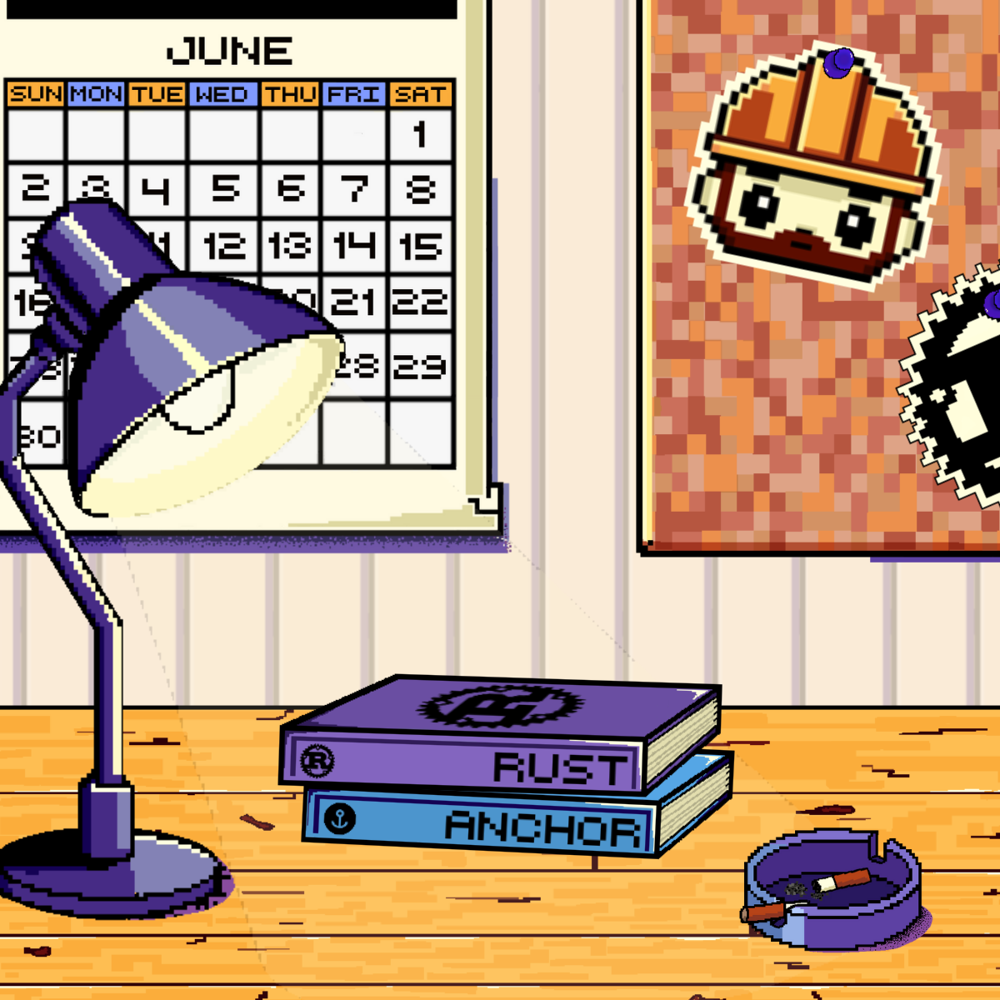

# Solfate Podcast #58 - Heavy Duty Builders 👷

In this repository, you will find the images needed to create the new drop on the Solfate DRIP channel. These include the 5 files required to fulfill the  channel's perks. Some images are available in both GIF and PNG formats. All images are square-sized (600x600) except the Ultimate one, which has a resolution of 1800x1600. If any changes are needed, please let us know.

    
    
    
    
    

## Images Hierarchy 📁

Based on the Solfate drip channel perks, we noticed you provide 5 types of NFTs: 1 Normal, 1 Rare, 1 Legendary, 1 Super Legendary, and 1 Ultimate. We created 5 images accordingly. The first 4 are part of the same composition, while the Ultimate one is a slightly different take. Here they are:

###  - ULTIMATE 

The Ultimate image has two formats: a GIF with small animations and a PNG if needed.

<table>
    <tr>
        <td valign="top" style="min-width:360px; width:360px; max-width:360px;">
            
            
<b>GIF FORMAT</b>

        </td>
        <td valign="top" style="min-width:360px; width:360px; max-width:360px;">
            
            
<b>PNG FORMAT</b>

        </td>
    </tr>
</table>

Cloudinary links if needed:
- [GIF file](https://res.cloudinary.com/andresmgsl/image/upload/v1719768689/DRIP-Ultimate_oleo3b.gif)
- [PNG file](https://res.cloudinary.com/andresmgsl/image/upload/v1719768713/DRIP-Ultimate_l2pj31.png)

###  - SUPER LEGENDARY

The Super Legendary image has two formats: a GIF with small animations and a PNG if needed.

<table>
    <tr>
        <td style="min-width:250px; width:250px; max-width:250px;">
            
            
<b>GIF FORMAT</b>

        </td>
        <td style="min-width:250px; width:250px; max-width:250px;">
            
            
<b>PNG FORMAT</b>

        </td>
    </tr>
</table>

Cloudinary links if needed:
- [GIF file](https://res.cloudinary.com/andresmgsl/image/upload/v1719768689/DRIP-Legendary2_rtlrzv.gif)
- [PNG file](https://res.cloudinary.com/andresmgsl/image/upload/v1719764500/DRIP-Rare_v0z0pf.png)

###  - LEGENDARY

The Legendary image has two formats: a GIF with small animations and a PNG if needed.

<table>
    <tr>
        <td style="min-width:250px; width:250px; max-width:250px;">
            
            
<b>GIF FORMAT</b>

        </td>
        <td style="min-width:250px; width:250px; max-width:250px;">
            
            
<b>PNG FORMAT</b>

        </td>
    </tr>
</table>

Cloudinary links if needed:
- [GIF file](https://res.cloudinary.com/andresmgsl/image/upload/v1719768689/DRIP-Legendary1_u5xpxg.gif)
- [PNG file](https://res.cloudinary.com/andresmgsl/image/upload/v1719764501/DRIP-Legendary2_i0ns2d.png)

###  - RARE

The Rare image has one format: PNG.

<table>
    <tr>
        <td style="min-width:250px; width:250px; max-width:250px;">
            
            
<b>PNG FORMAT</b>

        </td>
    </tr>
</table>

Cloudinary link if needed:
- [PNG file](https://res.cloudinary.com/andresmgsl/image/upload/v1719764501/DRIP-Legendary1_g6zog2.png)

### NORMAL

The Normal image has one format: PNG.

<table>
    <tr>
        <td style="min-width:250px; width:250px; max-width:250px;">
            
            
<b>PNG FORMAT</b>

        </td>
    </tr>
</table>

Cloudinary link if needed:
- [PNG file](https://res.cloudinary.com/andresmgsl/image/upload/v1719764500/DRIP-Normal_x2ynqj.png)

## Drip Example 🖼️

We did a little Photoshop to show how the Solfate channel page on DRIP should look with these images, to illustrate our vision. All the text and data were randomly selected and should be ignored.

## Storage 📦

After review, if everything is okay, we can store all the images in Arweave. Currently, images are only available in this 
repository or via the corresponding Cloudinary links.
